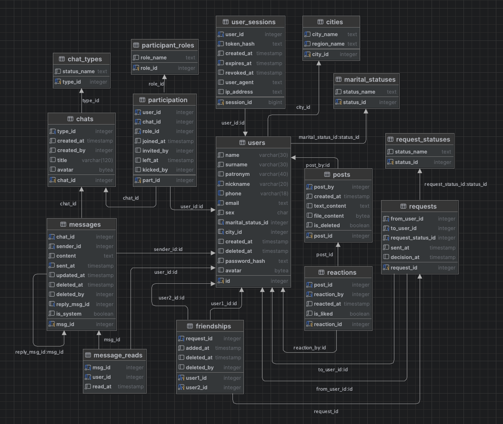

# Социальная сеть «Freedom»

Учебный проект социальной сети на **FastAPI + PostgreSQL** с классическими модулями: профиль, друзья, личные и групповые чаты, посты и настройки аккаунта.

## 1) Стек и архитектура

- **Backend:** FastAPI.
- **DB:** PostgreSQL, доступ через `asyncpg`.
- **Шаблоны/Frontend:** Jinja2 (HTML) + статические JS/CSS.
- **Аутентификация:** cookie-сессии (`session_token`) + таблица `user_sessions`.
- **Realtime:** WebSocket для событий мессенджера (`/api/messages/ws`).

Основные маршруты подключаются в `main.py`:
- `/api/users`
- `/api/settings`
- `/api/friends`
- `/api/messages`
- `/api/posts`

## 2) Модель данных (таблицы, поля, типы, ограничения)

Инициализация БД происходит через `queries/init/schema.sql`

---

### ER-диаграмма



---

### 2.1 Справочники

#### `marital_statuses`
| Поле | Тип | Ограничения | Описание |
|---|---|---|---|
| `status_id` | `SERIAL` | `PRIMARY KEY` | ID семейного статуса |
| `status_name` | `TEXT` | `NOT NULL` | Название статуса |

#### `cities`
| Поле | Тип | Ограничения | Описание |
|---|---|---|---|
| `city_id` | `SERIAL` | `PRIMARY KEY` | ID города |
| `region_name` | `TEXT` | `NOT NULL` | Регион |
| `city_name` | `TEXT` | `NOT NULL` | Название города |

- `UNIQUE(city_name, region_name)` - защита от дубликатов города в одном регионе

#### `request_statuses`
| Поле | Тип | Ограничения | Описание |
|---|---|---|---|
| `status_id` | `SERIAL` | `PRIMARY KEY` | ID статуса заявки в друзья |
| `status_name` | `TEXT` | `NOT NULL` | Название статуса |

**Возможные значения:**
- **pending** - заявка еще висит
- **accepted** - заявка принята (после создается "дружба")
- **cancelled** - заявка отклонена
- **rejected** - заявка отменена

#### `chat_types`
| Поле | Тип | Ограничения | Описание |
|---|---|---|---|
| `type_id` | `SERIAL` | `PRIMARY KEY` | ID типа чата |
| `status_name` | `TEXT` | `NOT NULL` | Название типа |

**Возможные значения:**
- **direct** - диалог/личные сообщения
- **group** - группа/беседа из нескольких человек

#### `participant_roles`
| Поле | Тип | Ограничения | Описание |
|---|---|---|---|
| `role_id` | `SERIAL` | `PRIMARY KEY` | ID роли участника чата |
| `role_name` | `TEXT` | `NOT NULL` | Название роли |

**Возможные значения:**
- **member** - участник чата
- **admin** - администратор группы
- **owner** - владелец группы

---

### 2.2 Пользователи и соц взаимодействия

#### `users`
| Поле | Тип | Ограничения | Описание |
|---|---|---|---|
| `id` | `SERIAL` | `PRIMARY KEY` | ID пользователя |
| `name` | `VARCHAR(30)` | `NOT NULL`, `DEFAULT 'Name'` | Имя |
| `surname` | `VARCHAR(30)` | `NOT NULL`, `DEFAULT 'Surname'` | Фамилия |
| `patronym` | `VARCHAR(40)` | `DEFAULT NULL` | Отчество |
| `nickname` | `VARCHAR(20)` | `UNIQUE`, `NOT NULL` | Никнейм |
| `phone` | `VARCHAR(18)` | `UNIQUE`, `DEFAULT NULL` | Телефон |
| `email` | `TEXT` | `UNIQUE`, `NOT NULL` | Email |
| `sex` | `CHAR(1)` | `NOT NULL` | Пол (`М`/`Ж`) |
| `marital_status_id` | `INTEGER` | `FK`, `DEFAULT NULL` | Семейный статус |
| `city_id` | `INTEGER` | `FK`, `DEFAULT NULL` | Город |
| `created_at` | `TIMESTAMP` | - | Дата создания |
| `deleted_at` | `TIMESTAMP` | `DEFAULT NULL` | Soft-delete метка |
| `password_hash` | `TEXT` | `NOT NULL` | Хэш пароля |
| `avatar` | `BYTEA` | `DEFAULT NULL` | Бинарные данные аватара |

FK:
- `marital_status_id -> marital_statuses.status_id` (`ON DELETE SET NULL`, `ON UPDATE CASCADE`)
- `city_id -> cities.city_id` (`ON DELETE SET NULL`, `ON UPDATE CASCADE`)

Индексы:
- `users_nickname_lower_unique_idx` (`UNIQUE (LOWER(nickname))`)
- `users_email_lower_unique_idx` (`UNIQUE (LOWER(email))`)

#### `user_sessions`
| Поле | Тип | Ограничения | Описание |
|---|---|---|---|
| `session_id` | `BIGSERIAL` | `PRIMARY KEY` | ID сессии |
| `user_id` | `INTEGER` | `NOT NULL`, `FK` | Пользователь |
| `token_hash` | `TEXT` | `NOT NULL`, `UNIQUE` | Хэш токена cookie |
| `created_at` | `TIMESTAMP` | `NOT NULL`, `DEFAULT NOW()` | Создана |
| `expires_at` | `TIMESTAMP` | `NOT NULL` | Истекает |
| `revoked_at` | `TIMESTAMP` | `DEFAULT NULL` | Отозвана |
| `user_agent` | `TEXT` | - | User-Agent клиента |
| `ip_address` | `TEXT` | - | IP клиента |

FK:
- `user_id -> users.id` (`ON DELETE CASCADE`)

Индексы:
- `user_sessions_user_id_idx` по `user_id`
- `user_sessions_expires_at_idx` по `expires_at`

#### `requests`
| Поле | Тип | Ограничения | Описание |
|---|---|---|---|
| `request_id` | `SERIAL` | `PRIMARY KEY` | ID заявки |
| `from_user_id` | `INTEGER` | `NOT NULL`, `FK` | Кто отправил заявку |
| `to_user_id` | `INTEGER` | `NOT NULL`, `FK` | Кому отправили |
| `request_status_id` | `INTEGER` | `NOT NULL`, `DEFAULT 0`, `FK` | Статус заявки |
| `sent_at` | `TIMESTAMP` | `NOT NULL` | Когда отправлена |
| `decision_at` | `TIMESTAMP` | `DEFAULT NULL` | Когда принято решение |

FK:
- `from_user_id -> users.id` (`ON DELETE CASCADE`)
- `to_user_id -> users.id` (`ON DELETE CASCADE`)
- `request_status_id -> request_statuses.status_id` (`ON DELETE RESTRICT`)

#### `friendships`
| Поле | Тип | Ограничения | Описание                            |
|---|---|---|-------------------------------------|
| `user1_id` | `INTEGER` | `NOT NULL`, `PK(part)`, `FK` | Первый пользователь в сорт. паре    |
| `user2_id` | `INTEGER` | `NOT NULL`, `PK(part)`, `FK` | Второй пользователь в сорт. паре    |
| `request_id` | `INTEGER` | `NOT NULL`, `UNIQUE`, `FK` | Заявка, по которой создалась дружба |
| `added_at` | `TIMESTAMP` | `NOT NULL` | Когда стали друзьями                |
| `deleted_at` | `TIMESTAMP` | `DEFAULT NULL` | Когда дружба удалена                |
| `deleted_by` | `INTEGER` | `DEFAULT NULL` | Кто удалил дружбу                   |

Ограничения:
- `CHECK(user1_id < user2_id)` - одна и та же пара хранится в едином порядке
- `PRIMARY KEY (user1_id, user2_id)`

FK:
- `user1_id -> users.id` (`ON DELETE CASCADE`)
- `user2_id -> users.id` (`ON DELETE CASCADE`)
- `request_id -> requests.request_id` (`ON DELETE CASCADE`)

---

### 2.3 Чаты и сообщения

#### `chats`
| Поле | Тип | Ограничения | Описание |
|---|---|---|---|
| `chat_id` | `SERIAL` | `PRIMARY KEY` | ID чата |
| `type_id` | `INTEGER` | `NOT NULL`, `DEFAULT 0`, `FK` | Тип чата |
| `title` | `VARCHAR(120)` | `DEFAULT NULL` | Название (для группы) |
| `avatar` | `BYTEA` | `DEFAULT NULL` | Аватар чата |
| `created_at` | `TIMESTAMP` | `NOT NULL` | Время создания |
| `created_by` | `INTEGER` | `NOT NULL` | Создатель |

FK:
- `type_id -> chat_types.type_id` (`ON DELETE RESTRICT`)

#### `participation`
| Поле | Тип | Ограничения | Описание                                           |
|---|---|---|----------------------------------------------------|
| `part_id` | `SERIAL` | `PRIMARY KEY` | ID записи участия                                  |
| `user_id` | `INTEGER` | `NOT NULL`, `FK` | Участник                                           |
| `chat_id` | `INTEGER` | `NOT NULL`, `FK` | Чат                                                |
| `role_id` | `INTEGER` | `NOT NULL`, `DEFAULT 0`, `FK` | Роль в чате                                        |
| `joined_at` | `TIMESTAMP` | `NOT NULL` | Когда вошёл                                        |
| `invited_by` | `INTEGER` | - | Кто пригласил/вернул                               |
| `left_at` | `TIMESTAMP` | `DEFAULT NULL` | Когда вышел/был исключён                           |
| `kicked_by` | `INTEGER` | `DEFAULT NULL` | Кто исключил (или сам пользователь при самовыходе) |

FK:
- `role_id -> participant_roles.role_id` (`ON DELETE RESTRICT`)
- `user_id -> users.id` (`ON DELETE CASCADE`)
- `chat_id -> chats.chat_id` (`ON DELETE CASCADE`)

Индекс:
- `participation_user_chat_active_idx` по `(user_id, chat_id)` с условием `left_at IS NULL`

#### `messages`
| Поле | Тип | Ограничения | Описание |
|---|---|---|---|
| `msg_id` | `SERIAL` | `PRIMARY KEY` | ID сообщения |
| `chat_id` | `INTEGER` | `NOT NULL`, `FK` | Чат |
| `sender_id` | `INTEGER` | `NOT NULL`, `FK` | Отправитель |
| `content` | `TEXT` | `NOT NULL`, `CHECK(LENGTH(content) > 0)` | Текст сообщения |
| `reply_msg_id` | `INTEGER` | `DEFAULT NULL`, `FK` | Ответ на сообщение |
| `sent_at` | `TIMESTAMP` | `NOT NULL` | Время отправки |
| `updated_at` | `TIMESTAMP` | `DEFAULT NULL` | Время редактирования |
| `is_system` | `BOOLEAN` | `NOT NULL`, `DEFAULT FALSE` | Системное ли сообщение |
| `deleted_at` | `TIMESTAMP` | `DEFAULT NULL` | Время удаления |
| `deleted_by` | `INTEGER` | `DEFAULT NULL` | Кто удалил |

FK:
- `chat_id -> chats.chat_id` (`ON DELETE CASCADE`)
- `sender_id -> users.id` (`ON DELETE CASCADE`)
- `reply_msg_id -> messages.msg_id` (`ON DELETE SET NULL`)

Индексы:
- `messages_chat_id_msg_id_idx` по `(chat_id, msg_id DESC)` где `deleted_at IS NULL`
- `messages_chat_sent_at_idx` по `(chat_id, sent_at DESC)` где `deleted_at IS NULL`

#### `message_reads`
| Поле | Тип | Ограничения | Описание |
|---|---|---|---|
| `msg_id` | `INTEGER` | `NOT NULL`, `FK` | Какое сообщение прочитано |
| `user_id` | `INTEGER` | `NOT NULL`, `FK` | Кто прочитал |
| `read_at` | `TIMESTAMP` | `NOT NULL` | Когда прочитал |

FK:
- `msg_id -> messages.msg_id` (`ON DELETE CASCADE`)
- `user_id -> users.id` (`ON DELETE CASCADE`)

Индекс:
- `message_reads_unique_idx` (`UNIQUE(msg_id, user_id)`).

---

### 2.4 Посты

#### `posts`
| Поле | Тип | Ограничения | Описание |
|---|---|---|---|
| `post_id` | `SERIAL` | `PRIMARY KEY` | ID поста |
| `post_by` | `INTEGER` | `NOT NULL`, `FK` | Автор |
| `created_at` | `TIMESTAMP` | `NOT NULL`, `DEFAULT NOW()` | Время создания |
| `text_content` | `TEXT` | `DEFAULT NULL` | Текст поста |
| `file_content` | `BYTEA` | `DEFAULT NULL` | Вложение (изображение) |
| `is_deleted` | `BOOLEAN` | `NOT NULL`, `DEFAULT FALSE` | Soft-delete флаг |

FK:
- `post_by -> users.id` (`ON DELETE CASCADE`)

Ограничения:
- `CHECK(NULLIF(BTRIM(COALESCE(text_content, '')), '') IS NOT NULL OR file_content IS NOT NULL)` - пост не может быть пустым

Индекс:
- `posts_post_by_post_id_idx` по `(post_by, post_id DESC)`

#### `reactions`
| Поле | Тип | Ограничения | Описание |
|---|---|---|---|
| `reaction_id` | `SERIAL` | `PRIMARY KEY` | ID реакции |
| `post_id` | `INTEGER` | `NOT NULL`, `FK` | Пост |
| `reaction_by` | `INTEGER` | `NOT NULL`, `FK` | Кто поставил |
| `reacted_at` | `TIMESTAMP` | `NOT NULL`, `DEFAULT NOW()` | Когда поставлена |
| `is_liked` | `BOOLEAN` | `NOT NULL` | Тип реакции (`true`=лайк, `false`=дизлайк) |

FK:
- `post_id -> posts.post_id` (`ON DELETE CASCADE`)
- `reaction_by -> users.id` (`ON DELETE CASCADE`)

Ограничения и индексы:
- `UNIQUE (post_id, reaction_by)` - одна реакция пользователя на пост

Индекс:
- `reactions_post_id_idx` по `post_id`

---

## 3) Роли в чатах и логика взаимодействия

### 3.1 Пользовательские роли в беседах

Иерархическая структура: роль "выше" может делать все то, что может делать роль "ниже":

- `role_id = 0` - обычный участник чата
  - писать сообщения (удалять и редактировать свои сообщения).
- `role_id = 1` - админ
  - добавлять новых участников.
  - кикать обычных участников.
- `role_id = 2` - владелец чата
  - менять название и аватарку группы.
  - управлять ролями (повышать участников и понижать админов).
  - кикать админов.

### 3.2 Друзья и подписчики

Связь пользователей строится через заявки (`requests`) и дружбу (`friendships`):

- Отправка заявки переводит отношение в `outgoing` для отправителя и `incoming` для получателя (PENDING).
- Принятие заявки создаёт запись в `friendships` (ACCEPTED).
- Удаление друга не просто удаляет дружбу: создаётся «обратная» pending-заявка, поэтому у второй стороны пользователь виден как «подписчик» (REJECTED + PENDING).
- Отправитель может отменить заявку на друзья (CANCELLED).

### 3.3 Сообщения и участие в группе

- Если пользователь **сам вышел** из беседы, он может вернуться сам при отправке сообщения.
- Если пользователя **кикнули**, вернуть его может владелец или тот, кто кикнул.
- Системные сообщения (`is_system = true`) фиксируют события: создание беседы, добавление/удаление участников, выход и т. д.
- В беседу можно добавить только друга.

---

## 4) API

> Все методы ниже (кроме регистрации/логина/доступности) требуют авторизации cookie-сессией.

### 4.1 Users (`/api/users`)

- `POST /` - техническое создание пользователя (**deprecated**).
- `POST /register` - регистрация пользователя с валидацией.
- `GET /check-availability?nickname=&email=` - проверка занятости никнейма и email.
- `POST /login` - вход, выдаёт cookie `session_token`.
- `POST /logout` - выход (ревоук сессии и очистка cookie).
- `GET /me` - получить ID текущего пользователя.
- `GET /{user_id}/avatar` - получить аватар пользователя.
- `GET /{user_id}` - получить профиль пользователя + "отношение" к текущему.

### 4.2 Settings (`/api/settings`)

- `GET /me` - данные профиля для страницы настроек.
- `PUT /me` - обновление профиля (имя, ник, email, телефон, пол, статус, город).
- `GET /check-nickname?nickname=` - проверка занятости никнейма.
- `GET /check-email?email=` - проверка занятости email.
- `GET /marital-statuses` - справочник семейных статусов.
- `GET /cities?q=` - поиск города.
- `POST /avatar` - загрузка аватара (image/*, до 5 МБ).
- `DELETE /avatar` - удалить аватар.
- `POST /password` - сменить пароль.

### 4.3 Friends (`/api/friends`)

- `GET /` - список друзей текущего пользователя.
- `GET /incoming` - входящие заявки.
- `GET /outgoing` - исходящие заявки.
- `GET /search?q=` - поиск пользователей с вычислением "отношения".
- `GET /relationship/{user_id}` - "отношение" с конкретным пользователем.
- `POST /requests/{user_id}` - отправить заявку в друзья.
- `POST /incoming/{user_id}/accept` - принять входящую заявку.
- `POST /incoming/{user_id}/reject` - отклонить входящую заявку.
- `POST /outgoing/{user_id}/cancel` - отменить исходящую заявку.
- `DELETE /{user_id}` - удалить из друзей (и создать обратную заявку).
- `GET /user/{user_id}/friends` - друзья указанного пользователя.
- `GET /user/{user_id}/followers` - подписчики указанного пользователя.

### 4.4 Messages (`/api/messages`)

Диалоги/чаты:
- `GET /dialogs` - список диалогов/чатов.
- `GET /search?q=` - поиск кандидатов для диалога.
- `GET /dialogs/{chat_id}` - информация о чате и первом непрочитанном сообщении.
- `GET /dialogs/{chat_id}/participants` - участники чата.
- `GET /dialogs/{chat_id}/messages` - сообщения (пагинация `limit`, `before_id`, `after_id`).
- `GET /dialogs/{chat_id}/avatar` - аватар чата.

Управление группой:
- `POST /dialogs/group` - создать групповой чат.
- `POST /dialogs/{chat_id}/avatar` - загрузить аватар чата.
- `DELETE /dialogs/{chat_id}/avatar` - удалить аватар чата.
- `PATCH /dialogs/{chat_id}/title` - изменить название.
- `POST /dialogs/{chat_id}/leave` - выйти из беседы.
- `POST /dialogs/{chat_id}/participants/add` - добавить участников.
- `GET /dialogs/{chat_id}/addable-friends` - друзья, доступные для добавления.
- `POST /dialogs/{chat_id}/participants/{user_id}/remove` - исключить участника.
- `POST /dialogs/{chat_id}/participants/{user_id}/restore` - вернуть участника.
- `PATCH /dialogs/{chat_id}/participants/{user_id}/role` - сменить роль.

Личные диалоги и сообщения:
- `POST /dialogs/by-user/{target_user_id}` - открыть/создать диалог с другом.
- `POST /dialogs/by-user/{target_user_id}/messages` - отправить сообщение в диалог с пользователем.
- `POST /dialogs/{chat_id}/messages` - отправить сообщение в чат.
- `PATCH /messages/{msg_id}` - редактировать сообщение.
- `DELETE /messages/{msg_id}` - удалить сообщение.
- `POST /dialogs/{chat_id}/read` - отметить прочитанным.

Realtime:
- `WS /ws` - WebSocket-канал сообщений (ping/pong + серверные события `chat:*`, `message:*`).

### 4.5 Posts (`/api/posts`)

- `GET /user/{user_id}` - лента постов пользователя (пагинация).
- `GET /{post_id}/file` - получить вложение поста.
- `POST /` - создать пост (текст и/или изображение).
- `POST /{post_id}/reaction` - поставить/обновить лайк или дизлайк.
- `POST /{post_id}/reaction/delete` - убрать реакцию.
- `GET /{post_id}/reactions/users` - пользователи по реакциям (liked/disliked).
- `DELETE /{post_id}` - мягко удалить пост (soft delete).

---

## 5) Крутые и важные фичи проекта

1. **Нормализация дружбы:**
   - Пара друзей хранится один раз (`user1_id < user2_id`), это упрощает уникальность и поиск.

2. **Мягкое удаление:**
   - Сообщения и посты удаляются мягко (`deleted_at`/`is_deleted`), что полезно для аудита и целостности связей.

3. **Валидация на API-слое и DB-слое:**
   - Пустые сообщения/посты блокируются и в Python-логике, и `CHECK`-ограничениями в БД.

4. **Сессии хранятся в БД:**
   - Можно отозвать токен (`revoked_at`), учитывать срок жизни и метаданные устройства.

5. **Чат-логика через историю участий (`participation`):**
   - Выход/кик не удаляет историю, а закрывает текущую запись (`left_at`), что позволяет аккуратно восстанавливать участников.

6. **Диалог только между друзьями:**
   - Создать `by-user` диалог можно только если пользователи состоят в дружбе.

7. **Публичные страницы требуют авторизации:**
   - HTML-роуты (`/friends`, `/messages`, `/settings`, `/id...`) редиректят на `/login`, если сессии нет.

---

## 6) Быстрый запуск

WARNING > dw 

1. Установить зависимости Python и создать БД-клиент (для macOS локально):
```bash
bash setup.sh
```

2. Запустить:

```bash
uvicorn main:app --reload
```

После старта приложение само создаёт пул БД и инициализирует схему.
